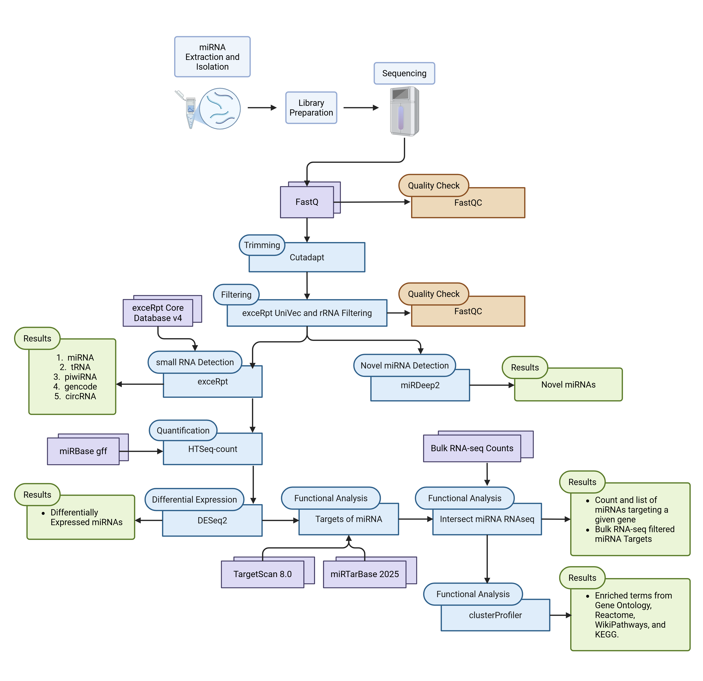

# utdal/miRNA-Analysis by [Axon Lab](https://labs.utdallas.edu/axonlab/)
This pipeline analyzes smallRNA-seq data by culminating several well established smallRNA-seq analysis packages into one automated workflow.



1. Preprocessing
    1. FastQC: assesses raw and post-trimming and filtering read qualities
    2. Cutadapt: the perform trimming
    3. UniVec filtering: this is from the exceRpt pipeline
2. Known Expression
    1. exceRpt: performs necessary alignments to reference datas in the following order: rRNA...
    2. HTSeq-count: takes the genome alignment bam from exceRpt and obtains the raw counts for known miRNAs (location from miRBase) specifically for DESeq2 analysis
3. Novel miRNA Detection
    1. miRDeep2: the best package currently for detecting novel miRNAs. The subworkflow for this was borrowed from the nf-core community, with some modifications.
    2. mergemiRDeep2: script to combine the detected novel miRNA across all samples based on the predicted hairpin sequence.
4. Differential Expression
    1. DESeq2: will automatically perform differential expression analysis of every condition combination based on the metadata file given. Plots will be created for each combination as well.
5. Functional Analysis
    1. Targets of miRNAs: obtains the gene targets of the differentially expressed miRNAs. The user will need to specify which DESeq2 output or list of miRNAs they are interested in.
    2. Intersect miRNA and RNA-seq: If the user chooses to provide Bulk RNA-seq counts from the same tissue, this process will select only the miRNA targeted genes from the previous process that appear in the Bulk RNA-seq. The user has the option to provide a minimum expression level for each gene in the Bulk RNA-seq. A count with the number of miRNAs targeting the gene is provided in the second column of the output file.
    3. clusterProfiler: enrichment analysis using the following databases: Gene Ontology (GO) Molecular Function, GO Biological Process, GO Cellular Component, KEGG, Reactome, and WikiPathways. Will output tables from each database with the genes and miRNAs associated with each enriched term.

## Installation and Setup of Pipeline
Download and setup conda (can use anaconda or miniconda) in your Linux machine's directory. You can find instructions on how: [anaconda download and setup](https://docs.anaconda.com/anaconda/install/)
Download the repository to your Linux machine using:
```
git clone https://github.com/utdal/miRNA-Analysis.git
```
Create conda environment for pipeline:
```
conda create --name mirna
conda activate mirna
conda install nextflow
conda install singularity
```

## Running pipeline
Go into the conf folder and open the user_sample.conf file. Configure parameters as needed. See Options section for more details.

To run pipeline:
```
nextflow run . -profile user_sample,singularity --workflow <mirna_expression/target_analysis> --outdir <output_directory_name>
```
The `--workflow <mirna_expression/target_analysis>` option is for selecting whether you are running the just the expression profiling or the target analysis. 

Other optional commands you can add
```
-bg # can add after nextflow in previous command to run the background (does not require terminal in which the command was executed to be open)
-resume # If you stop a run mid way, add this to the end of the command you used to run the pipeline and it will cache all the processes that have already completed.
```

## mirna_expression Options
### skip_preprocessing (optional) = `true or false`
Default is false. When set to true, skips preprocessing steps: fastqc, cutadapt (trimming), cutadapt (trimming), univec filtering (exceRpt), fastqc. **See Trimming section below for information on changing trimming parameters. Must modify parameters!** 

### skip_mirdeep2 (optional) = `true or false`
Default is false. When set to true, skips all miRDeep2 analysis.

### min_mirdeep2_score (optional) = `> 0`
Default is 4.0. See miRDeep2 paper for more information on how the miRDeep2 score is calcualted.

### meta_data_files (required) = `/path/to/meta_data_file.csv`
Must be a csv with the following format:

```
condition,csv
treatment,/path/to/treatment/metadata.csv
disease,/path/to/disease/state/metadata.csv
```
The purpose of this option is to allow for multiple DESeq2 analyses based on each metadata without having to rerun the pipeline. DESeq2 outputs will be saved and can be used to create more plots/figures. The script is available in bin/deseq2.R. See DESeq2 section below for more information on how analysis is conducted.

The format for each metadata file is as follows:
```
,treatment,sex
sample1,yes,female
sample2,yes,male
sample3,yes,male
sample4,no,female
sample5,no,female
sample6,no,male
```
Mistakes in formating will result in errors.

### min_padj (optional) = `< 0`
Minimum adjusted p-value. Default is 0.05. Applied for filtering significantly differentially expressed miRNAs. See DESeq2 paper for more information

### min_lfc (optional) = `≥ 0`
Minimum log fold change. Default is 0.58, which is a fold change of 1.5. Applied for filtering significantly differentially expressed miRNAs.

## target_analysis Options

### miRNA_DE (required) = `/path/to/differentially_expressed miRNAs.csv/.tsv`
Option 1: Can be DESeq2 output (from pipeline expecting *_shrinkage_apeglm_results.csv), 

Option 2: or a file with a miRNA on each line, 
```
miRNA
hsa-miR-21-5p
hsa-miR-144-3p
```
Option 3: or a tab separated file with miRNAs in one column and whether the miRNA is up- or down-regulated in another
```
miRNA   regulated
hsa-miR-21-5p	up
hsa-miR-144-5p	down
```
**Note** Headers with at least miRNA and/or regulated must be present in the files for options 2 and 3.

### deseq2_output (required) = `0 or 1`
File type of miRNA_DE file. Default is 1, meaning miRNA_DE is a DESeq2 output file. 0 represents options 2 and 3 for miRNA_DE.

### bulk_rna_counts (optional) = `/path/to/bulk_rnaseq_counts.csv`

```
Gene_Name,sample1,sample2,sample3
ASAP1,54.6,77,385
DICER1,1000,845.6,9239
```

### min_expression (optional) = `≥ 0`
Default is 0. Minimum mean read count (expression) for a gene in bulk RNA-seq. Genes that do not pass this threshold will filtered out of the miRNA target gene list. 

### experimental_evidence (optional) = `weak or strong`
Default is set to weak experimental evidence from [miRTarBase 2025](https://awi.cuhk.edu.cn/~miRTarBase/miRTarBase_2025/php/index.php). See miRTarBase2025 paper for more information.

### min_weighted_context_percentile (optional) = `0 - 100`
Default is 50. TargetScan 7.0 weighted context++ score ranks targets based upon the predicted repression. See [TargetScan v7.0](https://doi.org/10.7554/eLife.05005) for more information. 

### max_predicted_KD (optional) = `≤ 0.0`
Default is 0.0. TargetScan v8.0's Kd value is the predicted relative dissociation constant of the AGO2-miR complex. See [TargetScan v8.0](https://doi.org/10.1126/science.aav1741)

**Note** For computationally predicted targets, miRNA-RNA predictions were downloaded from [TargetScan v8.0](https://www.targetscan.org/cgi-bin/targetscan/data_download.vert80.cgi): Default predictions (conserved sites of conserved miRNA families): Predicted Targets context++ scores (updated 23 May 2022). 

## Trimming

Trimming for smallRNA-seq depending on the sequencing method. You may either trim reads outside the pipeline and use the skip_preprocessing option or modify the miRNA-Analysis/conf/modules.config file as desired. There are two blocks: CUTADAPT_APDAPTER (runs first) and CUTADAPT_EXTRA. This pipeline uses cutadapt v4.6. See [cutadapt v4.6](https://cutadapt.readthedocs.io/en/v4.6/guide.html) documentation and modify parameters as needed.

## DESeq2

For exact code details, see miRNA-Analysis/bin/deseq2.R. Differential expression analysis is conducted for each combination from the metadata. Beyond the basic DESeq2 workflow, log fold shrinkage is performed using the apeglm function. The differential expression analysis for each experimental combination, has the following format: "condition_testGroup_vs_referenceGroup." Condition will be a column from the metadata. See [DESeq2](https://bioconductor.org/packages/release/bioc/vignettes/DESeq2/inst/doc/DESeq2.html) documentation for more information. This pipeline uses DESeq2 v1.46.0.

## Credits
This pipeline was created and developed by Sneha Arya Gummadi (@SnehaGummadi) under the guidance of Dr. Diana Tavares-Ferreira (@dianatavf) at The University of Texas at Dallas.

## Support
For any problems/questions/concerns, leave an issue with the following information: 1. Command used to run pipeline. 2. Config file. 3. Error message. 

**Note** Be sure to omit paths for protected paths.

## Citations
This pipeline uses code and infrastructure developed and maintained by the [nf-core](https://nf-co.re) community, reused here under the [MIT license](https://github.com/nf-core/tools/blob/master/LICENSE).
 
> The nf-core framework for community-curated bioinformatics pipelines.
>
> Philip Ewels, Alexander Peltzer, Sven Fillinger, Harshil Patel, Johannes Alneberg, Andreas Wilm, Maxime Ulysse Garcia, Paolo Di Tommaso & Sven Nahnsen.
>
> Nat Biotechnol. 2020 Feb 13. doi: [10.1038/s41587-020-0439-x](https://doi.org/10.1038/s41587-020-0439-x).


This pipeline utilizes the following programs:
>Martin, Marcel. Cutadapt removes adapter sequences from high-throughput sequencing reads. EMBnet.journal, [S.l.], v. 17, n. 1, p. pp. 10-12, May 2011. ISSN 2226-6089. https://doi.org/10.14806/ej.17.1.200.

> Rozowsky, J., Kitchen, R. R., Park, J. J., Galeev, T. R., Diao, J., Warrell, J., Thistlethwaite, W., Subramanian, S. L., Milosavljevic, A., & Gerstein, M. (2019). exceRpt: A Comprehensive Analytic Platform for Extracellular RNA Profiling. Cell Systems, 8(4), 352-357.e3. https://doi.org/10.1016/j.cels.2019.03.004

> miRDeep2 accurately identifies known and hundreds of novel microRNA genes in seven animal clades | Nucleic Acids Research | Oxford Academic. (n.d.). Retrieved February 26, 2025, from https://academic.oup.com/nar/article/40/1/37/1275937?login=true

> Simon Anders, Paul Theodor Pyl, Wolfgang Huber HTSeq — A Python framework to work with high-throughput sequencing data Bioinformatics (2014), in print, online at doi:10.1093/bioinformatics/btu638

>Love, M.I., Huber, W. & Anders, S. Moderated estimation of fold change and dispersion for RNA-seq data with DESeq2. Genome Biol 15, 550 (2014). https://doi.org/10.1186/s13059-014-0550-8

>Shidong Cui, Sicong Yu, Hsi-Yuan Huang, Yang-Chi-Dung Lin, Yixian Huang, Bojian Zhang, Jihan Xiao, Huali Zuo, Jiayi Wang, Zhuoran Li, Guanghao Li, Jiajun Ma, Baiming Chen, Haoxuan Zhang, Jiehui Fu, Liang Wang, Hsien-Da Huang, miRTarBase 2025: updates to the collection of experimentally validated microRNA–target interactions, Nucleic Acids Research, Volume 53, Issue D1, 6 January 2025, Pages D147–D156, https://doi.org/10.1093/nar/gkae1072

>Vikram AgarwalGeorge W BellJin-Wu NamDavid P Bartel (2015) Predicting effective microRNA target sites in mammalian mRNAs eLife 4:e05005. https://doi.org/10.7554/eLife.05005

>Sean E. McGeary et al., The biochemical basis of microRNA targeting efficacy. Science 366, eaav1741 (2019). DOI: 10.1126/science.aav1741

> Yu G (2024). “Thirteen years of clusterProfiler.” The Innovation, 5(6), 100722. doi:10.1016/j.xinn.2024.100722, https://doi.org/10.1016/j.xinn.2024.100722.